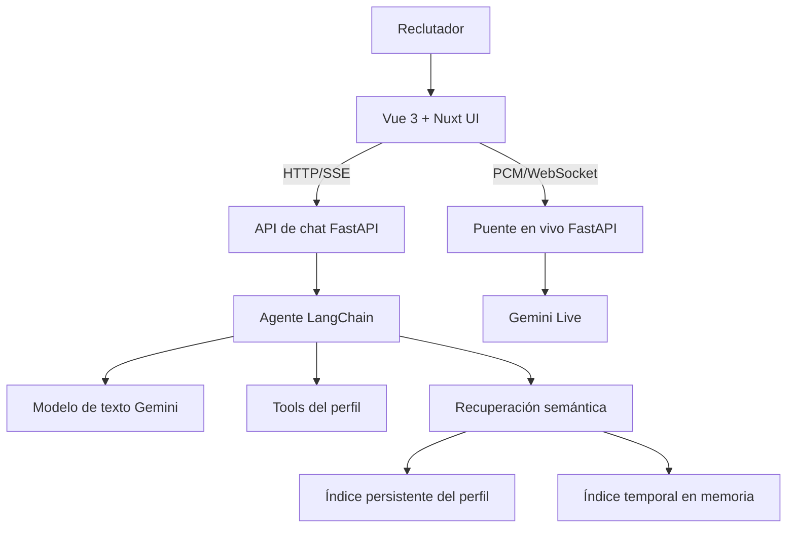

# awesome-ai-profile

> Un portafolio interactivo con IA donde los reclutadores pueden conversar con Django, el asistente profesional de Jeyker Salinas, mientras descubren la ingeniería detrás de cada funcionalidad.

[English version](README.md) · [Demo en vivo](https://proud-mud-0ed95371e.7.azurestaticapps.net/)

Esto no es un currículum renderizado como chat. Es una muestra funcional de ingeniería frontend, IA con agentes, RAG, audio en tiempo real, observabilidad y despliegue en Azure. Un reclutador puede preguntar por la experiencia de Jeyker, inspeccionar las fuentes de una respuesta, subir una oferta laboral para compararla temporalmente, solicitar sus datos públicos de contacto o hablar directamente con el asistente.

## Estado del demo

La versión actual está lista para mostrar. La experiencia principal funciona de extremo a extremo en inglés y español:

- Chat escrito con respuestas en streaming, reintentos, cancelación e historial durante la sesión.
- Conversación de voz nativa en vivo con audio del micrófono, respuestas habladas e interrupciones.
- Un puente WebSocket en FastAPI que mantiene la clave de Gemini y la ejecución de tools en el servidor.
- Un agente de LangChain respaldado por Gemini y con tool calling observable.
- Conocimiento profesional curado y RAG semántico sobre el perfil verificado.
- Ingesta temporal de PDF para CV, ofertas laborales, cartas y otros documentos de texto.
- Fuentes en línea, tarjetas con la foto del candidato y datos públicos de contacto.
- Un panel de **Actividad del agente** con eventos del modelo y las tools, duración y cantidad de resultados, sin exponer cadenas de pensamiento privadas.
- Explicaciones contextuales de **¿Por qué este feature es tan cool?** que enseñan la implementación sin llamadas adicionales al modelo.
- Un tour bilingüe por las tecnologías de la interfaz.
- Detección del idioma del navegador, selector EN/ES y tema claro/oscuro persistente.
- Logs estructurados sin secretos y feedback de errores localizado con referencias de solicitud.
- Un aviso de privacidad bilingüe en la primera visita al demo público.

La experiencia es intencionalmente un demo: la calidad del modelo, la cuota y la disponibilidad del modo en vivo pueden estar limitadas por el plan configurado con el proveedor.

## ¿Qué puede preguntar un reclutador?

- ¿Por qué deberíamos contratar a Jeyker?
- ¿Qué ha construido con Vue, TypeScript e IA?
- ¿Qué experiencia tiene con RAG, aplicaciones con LLM y desarrollo full-stack?
- Compara el perfil de Jeyker con esta oferta laboral.
- Muéstrame la evidencia que respalda esa respuesta.
- ¿Cómo fue construido y desplegado este proyecto?
- Muéstrame una foto de Jeyker.
- ¿Cómo puedo contactar a Jeyker?

El asistente puede ofrecer los datos públicos de contacto autorizados por Jeyker cuando detecta un interés profesional concreto. No envía correos ni mensajes y actualmente no ejecuta tools con efectos externos.

## Arquitectura



### Frontend

- Vue 3, TypeScript, Vite y Vue Router.
- Nuxt UI y Tailwind CSS como sistema de componentes y diseño.
- AI SDK para Vue (`@ai-sdk/vue`) y el protocolo UI Message Stream sobre HTTP/SSE.
- Renderizadores tipados para texto, fuentes, fotos, actividad y aprobaciones de tools.
- Captura de audio del navegador en PCM a 16 kHz y reproducción del audio de Gemini a 24 kHz.
- Preferencias con VueUse para idioma, tema, descubrimiento de features, uso de voz y aviso inicial.

Nuxt UI se utiliza como librería de componentes para Vue. Este repositorio no requiere Nuxt.js, Nitro ni un servidor Nuxt.

### Backend e IA

- Python 3.12+, FastAPI y Pydantic.
- `create_agent` de LangChain con Google Gemini.
- `gemini-3.1-flash-lite` para las respuestas escritas del agente.
- `gemini-3.1-flash-live-preview` para audio nativo en vivo por defecto.
- `gemini-embedding-001` para embeddings semánticos.
- ChromaDB con colecciones separadas para el perfil persistente y los documentos temporales del visitante.
- Tools compartidas para consultar el perfil, buscar experiencia y documentos, mostrar la foto y entregar datos de contacto.
- Logs JSON estructurados, correlación de solicitudes y clasificación segura de errores del proveedor.

### Endpoints públicos

| Endpoint | Finalidad |
| --- | --- |
| `GET /health` | Comprobación básica del backend |
| `POST /chat` | Respuesta de chat en JSON |
| `POST /chat/stream` | UI Message Stream de AI SDK sobre SSE |
| `POST /documents` | Validar, extraer, dividir e indexar un PDF |
| `DELETE /documents/{id}` | Eliminar un documento temporal |
| `WS /live/ws` | Audio bidireccional y eventos de tools en vivo |

## Cómo funcionan el RAG y la privacidad de documentos

Los documentos no necesitan compartir una estructura. Un CV, una oferta laboral o una carta se convierte en texto seleccionable, se divide en fragmentos solapados y se transforma en embeddings para la búsqueda semántica.

1. `pypdf` extrae el texto y los metadatos de cada página.
2. `RecursiveCharacterTextSplitter` de LangChain crea fragmentos de 900 caracteres con un solapamiento de 150 por defecto.
3. Gemini convierte cada fragmento en un embedding.
4. El conocimiento verificado del perfil se almacena en ChromaDB persistente.
5. Los documentos del visitante se guardan únicamente en un `EphemeralClient` en memoria.
6. Cada solicitud autoriza solo los identificadores de documentos adjuntos a esa conversación.
7. Los nombres de archivos recuperados y las rutas del conocimiento verificado regresan a la interfaz como fuentes.

Los documentos temporales se eliminan al quitarlos, caducan después de 30 minutos de inactividad por defecto y desaparecen cuando se reinicia el backend. El PDF original no se escribe en el volumen persistente de vectores. El contenido subido se trata como evidencia no confiable, no como instrucciones.

Los PDF deben contener texto seleccionable. Los documentos escaneados o compuestos solo por imágenes necesitan OCR, algo que todavía no está implementado. El límite predeterminado es de 10 MB.

## Modo de voz en vivo

El navegador envía el audio del micrófono a FastAPI. El backend abre una sesión de Gemini Live y retransmite audio nativo, transcripciones, actividad de tools y errores públicos. La sesión recibe el idioma seleccionado, hasta 20 mensajes recientes del chat escrito y cualquier documento temporal que ya estuviera adjunto.

El navegador conserva un contador diario ligero. El backend cierra cada WebSocket de forma independiente después de `GEMINI_LIVE_MAX_TURNS` turnos completados por el modelo (20 por defecto). Esto ayuda a proteger la cuota del demo, pero no es una frontera de seguridad; una limitación estricta requiere usuarios autenticados o un rate limiter confiable en el servidor.

El acceso al micrófono exige HTTPS en producción o localhost durante el desarrollo. Si falla una sesión en vivo, se puede ejecutar:

```bash
make live-diagnose
```

El diagnóstico prueba primero una conexión mínima con Gemini Live y después repite la prueba con las tools del agente. Lee la clave configurada sin imprimirla.

## Privacidad y términos del proveedor

En la primera visita, la interfaz explica que se trata de un demo público limitado y solicita que no se introduzca información personal, sensible, confidencial ni datos de terceros. También informa que los mensajes, el audio de voz y los documentos adjuntos se envían a Google Gemini, e incluye enlaces a los términos y la política de privacidad de Google. La confirmación se guarda únicamente en ese navegador mediante una clave versionada de `localStorage`.

Este aviso mejora la transparencia; no es una política de privacidad, un banner de cookies, un consentimiento legal ni un mecanismo completo de cumplimiento del RGPD. Antes de publicar el servicio, su responsable debe documentar, cuando corresponda, la identidad del responsable del tratamiento, la base jurídica, los encargados, la retención, las transferencias internacionales y el proceso para ejercer derechos.

Los términos actuales de la API de Gemini diferencian entre servicios pagados y gratuitos, y sus reglas de uso de datos dependen del plan y la región. También indican que los clientes API puestos a disposición de usuarios en el EEE, Suiza o Reino Unido solo pueden utilizar Servicios Pagados. Por lo tanto, un despliegue público que atienda esas regiones debería usar un proyecto de Cloud con facturación activa y revisarse conforme a los [términos vigentes de la API de Gemini](https://ai.google.dev/gemini-api/terms) y la [política de privacidad de Google](https://policies.google.com/privacy). El aviso de la interfaz no convierte en válida una configuración que el proveedor no permita.

La aplicación no conserva el historial del chat escrito. Sus logs estructurados registran metadatos operativos y diagnósticos de error depurados, no claves API ni respuestas crudas del proveedor. Consulta la [documentación de observabilidad](docs/observability.md).

## Desarrollo local

Requisitos:

- Node.js 22.18+ o 24.12+.
- Python 3.12+.
- Una clave de la API de Google Gemini.

```bash
cp backend/.env.example backend/.env
cp app/.env.example app/.env
# Sustituye GOOGLE_API_KEY dentro de backend/.env.
make install
make dev
```

Comandos útiles:

```bash
make front              # Iniciar el frontend Vue/Vite
make back               # Iniciar el backend FastAPI
make type-check         # Comprobar TypeScript del frontend
make build              # Construir el frontend para producción
make live-diagnose      # Diagnosticar la conexión con Gemini Live
make docker-back-build  # Construir la imagen del backend
make docker-back-run    # Ejecutar el contenedor del backend
make acr-login          # Autenticarse en Azure Container Registry
make deploy-back        # Construir, publicar y desplegar el backend
make logs-back          # Seguir los logs estructurados de la aplicación
make logs-back-system   # Leer los logs de sistema de Container Apps
```

Ejecutar las pruebas:

```bash
cd app && npm test
cd ../backend && python -m unittest discover -s tests -v
```

## Configuración

Variables importantes del backend:

```dotenv
GOOGLE_API_KEY=replace-with-your-real-api-key
CORS_ALLOW_ORIGINS=http://localhost:5173,http://127.0.0.1:5173
VECTOR_STORE_PATH=data/chroma
UPLOAD_TTL_MINUTES=30
GEMINI_LIVE_MODEL=gemini-3.1-flash-live-preview
GEMINI_LIVE_VOICE=Kore
GEMINI_LIVE_MAX_TURNS=20
LOG_LEVEL=INFO
```

El frontend utiliza `VITE_API_BASE_URL` para localizar FastAPI.

## Despliegue

- **Frontend:** Azure Static Web Apps, desplegado desde `main` mediante GitHub Actions.
- **Backend:** imagen Docker en Azure Container Registry ejecutada en Azure Container Apps.
- **Logs:** salida estándar del contenedor, disponible en Azure Container Apps y opcionalmente en Log Analytics.
- **Vectores del perfil:** volumen opcional montado en `VECTOR_STORE_PATH`.
- **Vectores del visitante:** solo en memoria; nunca se almacenan en ese volumen.

`develop` contiene el siguiente candidato a lanzamiento. Un pull request de `develop` hacia `main` promueve la versión a producción, y el merge en `main` inicia el workflow de despliegue del frontend.

## Estructura del repositorio

```text
awesome-ai-profile/
├── app/
│   ├── public/django_design/    # Recursos de marca
│   ├── src/components/          # Chat, modo en vivo, tour y aviso de privacidad
│   ├── src/composables/         # Idioma y preferencias persistentes
│   ├── src/features/            # Lógica de voz, tour y explicaciones
│   ├── src/types/               # Contratos tipados de mensajes y eventos
│   └── tests/                   # Pruebas de lógica y contratos del frontend
├── backend/
│   ├── agents/                  # Agente, tools y eventos de actividad
│   ├── knowledge/               # Conocimiento profesional verificado
│   ├── routes/                  # Endpoints HTTP y WebSocket
│   ├── schemas/                 # Contratos Pydantic
│   ├── services/                # RAG, audio en vivo, prompts y streaming
│   └── tests/                   # Pruebas unitarias del backend
├── docs/                        # Guías del tour, actividad y observabilidad
├── .github/workflows/           # CI/CD de Azure Static Web Apps
├── docker-compose.yml
├── Makefile
├── LEEME.md
└── README.md
```

## Lo que todavía no se afirma

- No existe memoria durable de conversaciones.
- No existe control de cuota autenticado por usuario.
- No existe OCR para PDF escaneados.
- No existe autorización ni rate limiting de nivel producción.
- No existe todavía un efecto externo real con human-in-the-loop; la interfaz de aprobación está preparada, pero las tools actuales son de solo lectura.
- No se expone la cadena de pensamiento. El panel de actividad muestra únicamente eventos operativos.
- No se afirma un cumplimiento completo del RGPD basado únicamente en un aviso inicial.

## Próximos hitos

- [ ] Añadir pruebas de integración de API y end-to-end con Playwright.
- [ ] Ejecutar automáticamente las pruebas de frontend y backend en CI.
- [ ] Añadir rate limiting autenticado y protección contra abuso.
- [ ] Construir un dataset de evaluación con preguntas de reclutadores.
- [ ] Medir groundedness, relevancia de recuperación, latencia y uso de tokens.
- [ ] Añadir readiness checks, comprobación de dependencias, trazas y métricas.
- [ ] Documentar la política de privacidad final y la configuración de tratamiento de datos de producción.
- [ ] Automatizar la publicación, el despliegue y el rollback del backend.

## Principios de ingeniería

1. Software funcional por encima del teatro arquitectónico.
2. Separar con claridad las capacidades actuales de los planes futuros.
3. Contratos tipados entre frontend, backend y servicios de IA.
4. Evidencia verificada por encima de respuestas impresionantes pero sin fundamento.
5. Comportamiento observable sin exponer razonamiento privado ni secretos.
6. Entrega incremental, documentación honesta y costes operativos controlados.
