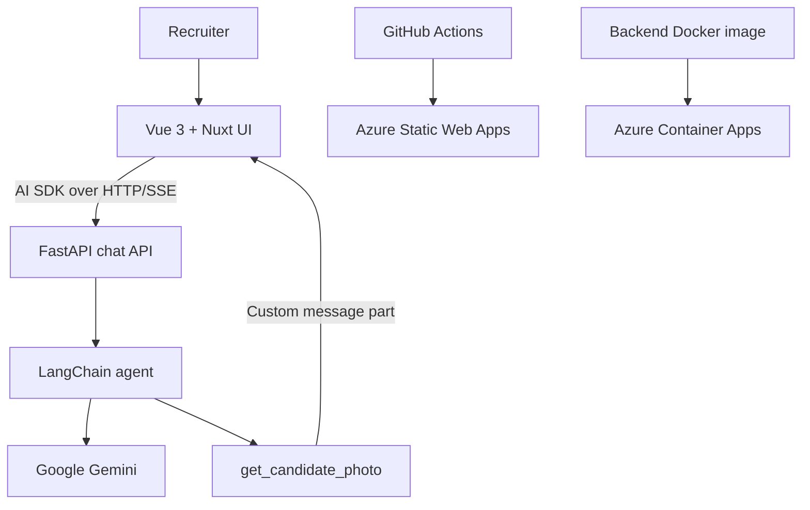

# awesome-ai-profile

> An interactive AI-powered professional profile built with Vue 3, Nuxt UI, FastAPI, LangChain and Gemini.

**Live application:** https://proud-mud-0ed95371e.7.azurestaticapps.net/

Instead of reading a static résumé, recruiters can talk to Django: an AI assistant representing Jeyker Salinas' professional profile. The project also serves as a practical portfolio for applied AI engineering, frontend development, backend integration and cloud deployment.

## What works today

- Responsive recruiter-facing chat built with **Nuxt UI**, **Vue 3**, **TypeScript** and **Tailwind CSS**.
- AI SDK for Vue (`@ai-sdk/vue`) with streamed responses, retry, cancellation and in-session conversation history.
- FastAPI backend that implements the AI SDK UI Message Stream Protocol over **HTTP/SSE**; WebSockets and a Nuxt server are not required.
- Gemini integration through LangChain, including real agent tool calling.
- A `get_candidate_photo` tool whose result appears inline as a custom photo card.
- Extensible typed message parts for photos, technology badges and project cards.
- An approval component prepared for human-in-the-loop tools; an actual approval-required backend tool is still pending.
- English and Spanish localization with browser-language detection, an English fallback and a persistent language switcher.
- System-aware light/dark mode with a persistent toggle and Django's brand palette.
- Backend unit tests for request validation, conversation history, stream ordering and provider errors.
- Azure Static Web Apps deployment through GitHub Actions, plus Docker/Azure Container Apps deployment commands for the backend.

## Product goal

A recruiter should eventually be able to ask:

- Why should we hire Jeyker?
- What has he built with Vue, TypeScript and AI?
- What experience does he have with RAG, LLM applications and full-stack development?
- How was this project built and deployed?
- Can you show his profile photo, relevant projects or supporting sources?
- Can you send Jeyker a message after obtaining explicit approval?

The current assistant can stream answers and execute the photo tool. A curated knowledge base, grounded retrieval, source citations and recruiter contact workflows are planned; they are not yet implemented.

## Current architecture



### Frontend

- Vue 3 and TypeScript.
- Vite and Vue Router.
- **Nuxt UI** and Tailwind CSS for the complete chat experience and design system.
- Vercel AI SDK for Vue: `useChat`, `DefaultChatTransport`, message parts and tool-approval responses.
- VueUse for persisted language preferences and automatic light/dark theme detection.
- Typed custom renderers for text, profile photos, technology lists, project cards and approval requests.
- English/Spanish localization with automatic detection and manual selection.

The project uses Nuxt UI as a Vue component library. It does **not** require Nuxt.js, Nitro, a hosted chat backend or WebSockets.

### Backend and AI

- Python 3.12+, FastAPI and Pydantic.
- `POST /chat` for a regular JSON response.
- `POST /chat/stream` for the AI SDK UI Message Stream Protocol.
- `GET /health` for a basic health check.
- LangChain agent backed by Google Gemini.
- Typed streaming events and custom candidate-photo message parts.
- Environment-based configuration for the model API key, CORS and deployment settings.

The current agent uses LangChain's `create_agent`. An explicitly modeled LangGraph workflow, provider switching, durable agent state and approval-gated side effects are future improvements rather than current capabilities.

### Infrastructure and deployment

- **Frontend:** Azure Static Web Apps, deployed from `main` by GitHub Actions.
- **Backend:** Dockerfile and Makefile targets for Azure Container Registry and Azure Container Apps.
- **Local database groundwork:** Docker Compose can start PostgreSQL, but the application does not yet persist conversations or implement pgvector-based retrieval.

AWS remains an alternative for future experimentation, but Azure is the deployment platform represented by the current repository.

## Versioning and releases

This project follows semantic versioning (`MAJOR.MINOR.PATCH`). The first functional chat release is **0.1.0**.

- `develop` contains completed work that is being prepared for the next release.
- A pull request from `develop` to `main` promotes that version to production.
- Merging into `main` triggers the Azure Static Web Apps deployment workflow.
- After the production deployment succeeds, tag the corresponding `main` commit as `v0.1.0`.
- Use `0.1.1` for backward-compatible fixes, `0.2.0` for the next feature milestone, and `1.0.0` once the intended recruiter experience is stable.

The application version is recorded in `app/package.json` and `app/package-lock.json`. Git tags should point to the production commit, not to an unmerged development branch.

## Local development

Create the local environment files from the provided examples, configure `GOOGLE_API_KEY`, then use the Makefile targets:

```bash
make install
make dev
```

Useful commands:

```bash
make front              # Start the Vue/Vite frontend
make back               # Start the FastAPI backend
make type-check         # Check frontend TypeScript types
make build              # Build the frontend for production
make docker-back-build  # Build the backend Docker image
make docker-back-run    # Run the backend container locally
make acr-login          # Authenticate with Azure Container Registry
make deploy-back        # Build, push and deploy the backend to Azure
```

Run the existing backend tests with:

```bash
cd backend
python -m unittest discover -s tests -v
```

## Repository structure

```text
awesome-ai-profile/
├── app/                         # Vue 3 + Nuxt UI + AI SDK frontend
│   ├── public/django_design/    # Django logo, icons and brand assets
│   └── src/
│       ├── components/chat/     # Message, photo and approval components
│       ├── composables/         # Browser localization and preferences
│       ├── types/               # Typed message parts and stream contracts
│       └── views/               # Recruiter-facing chat
├── backend/                     # FastAPI + LangChain + Gemini
│   ├── agents/                  # Agent and callable tools
│   ├── routes/                  # Chat API endpoints
│   ├── schemas/                 # Pydantic request/event models
│   ├── services/                # Agent and AI SDK SSE adapters
│   ├── tests/                   # Stream and request unit tests
│   └── Dockerfile
├── .github/workflows/           # Azure Static Web Apps deployment
├── docker-compose.yml           # Local PostgreSQL service
├── Makefile                     # Development and Azure deployment tasks
└── README.md
```

## Development roadmap

Checked items correspond to functionality present in the repository; unchecked items are still planned.

### Phase 0 — Project foundations

**Goal:** establish a working local development environment.

- [x] Create the frontend/backend monorepo structure.
- [x] Create the Vue 3 + TypeScript application.
- [x] Create the FastAPI application.
- [x] Add a `/health` endpoint.
- [x] Connect the frontend to the backend.
- [x] Run the frontend and backend together with `make dev`.
- [x] Add a production-ready backend Dockerfile.
- [x] Provide Docker Compose configuration for local PostgreSQL.
- [ ] Add consistent formatting and linting commands.
- [ ] Add a single command that also starts every required infrastructure service.

### Phase 1 — Recruiter chat and Nuxt UI

**Goal:** deliver a polished, useful conversational portfolio.

- [x] Build a responsive recruiter chat with Nuxt UI and Tailwind CSS.
- [x] Add predefined recruiter prompt suggestions.
- [x] Stream responses with the AI SDK protocol over HTTP/SSE.
- [x] Integrate Vue `useChat` with the existing FastAPI backend.
- [x] Connect the LangChain agent to Google Gemini.
- [x] Keep conversation history during the active chat session.
- [x] Support cancellation, retry and structured streaming errors.
- [x] Render typed custom message parts and profile-photo cards.
- [x] Add English/Spanish localization with browser detection and manual switching.
- [x] Add system-aware light/dark mode with the Django brand palette.
- [ ] Add Markdown rendering and richer assistant-message formatting.
- [ ] Add a clean provider abstraction for swapping LLMs.
- [ ] Persist conversations across browser sessions.

### Phase 2 — Grounded professional knowledge and RAG

**Goal:** make answers factual, grounded and traceable.

- [ ] Convert Jeyker's CV, projects, education and skills into curated documents.
- [ ] Implement document ingestion and chunking.
- [ ] Generate embeddings.
- [ ] Configure PostgreSQL with pgvector.
- [ ] Implement semantic retrieval.
- [ ] Build grounded prompts from retrieved context.
- [ ] Cite supporting sources in the chat interface.
- [ ] Add retrieval and grounded-answer tests.

### Phase 3 — Controlled agent tools

**Goal:** move from a conversational assistant to a safe, useful agent.

- [x] Create a LangChain agent with tool-calling support.
- [x] Implement the `get_candidate_photo` tool.
- [x] Render tool results inline as custom message components.
- [x] Prepare an approval UI for human-in-the-loop interactions.
- [ ] Introduce an explicit LangGraph workflow when orchestration complexity requires it.
- [ ] Model durable agent state explicitly.
- [ ] Implement `search_experience`.
- [ ] Implement `get_profile_section`.
- [ ] Implement `create_contact_request`.
- [ ] Require and enforce approval before side-effecting tools run.
- [ ] Add tool authorization, rate limits and audit logs.
- [ ] Test invalid, malicious and denied tool requests.

### Phase 4 — AI evaluation

**Goal:** measure answer quality instead of relying on impressions.

- [ ] Create a recruiter-question evaluation dataset.
- [ ] Measure retrieval relevance and expected-fact coverage.
- [ ] Evaluate groundedness and hallucinations.
- [ ] Measure request/model latency.
- [ ] Track token usage and estimated cost.
- [ ] Run regression evaluations in CI.
- [ ] Compare at least two model configurations.

### Phase 5 — Production engineering

**Goal:** improve reliability, safety and observability.

- [x] Add backend unit tests for chat requests and SSE message streams.
- [x] Add a basic backend health endpoint.
- [x] Configure CORS and environment-based secrets.
- [ ] Add API integration tests.
- [ ] Add frontend component tests.
- [ ] Add Playwright end-to-end tests.
- [ ] Add readiness checks and dependency health checks.
- [ ] Add rate limiting and request-size limits.
- [ ] Add structured logs, traces and metrics.
- [ ] Add retry, timeout and fallback policies.
- [ ] Add prompt/model versioning.
- [ ] Add security headers and dependency vulnerability checks.

### Phase 6 — Azure deployment

**Goal:** demonstrate ownership from source code to production.

- [x] Deploy the frontend to Azure Static Web Apps.
- [x] Build the backend with a production Dockerfile.
- [x] Provide Azure Container Registry login and image-push commands.
- [x] Provide Azure Container Apps backend deployment commands.
- [x] Configure HTTPS platform URLs and environment-based secrets.
- [ ] Provision and connect managed PostgreSQL.
- [ ] Configure centralized production logs and monitoring.
- [ ] Configure an optional custom domain.
- [ ] Document the actual Azure architecture and operating cost.

### Phase 7 — CI/CD

**Goal:** make quality checks and deployments reproducible.

- [x] Add a GitHub Actions workflow.
- [x] Build and deploy the frontend from `main` to Azure Static Web Apps.
- [x] Configure preview handling for pull requests targeting `main`.
- [ ] Run frontend linting and tests explicitly in CI.
- [ ] Run backend tests automatically.
- [ ] Run AI smoke evaluations.
- [ ] Build and publish the backend Docker image automatically.
- [ ] Deploy the backend automatically.
- [ ] Add rollback and release-recovery procedures.

### Phase 8 — Advanced AI engineering

Only after the grounded recruiter experience and controlled tools work end to end:

- [ ] Add model routing.
- [ ] Add semantic caching.
- [ ] Add reranking.
- [ ] Define a durable conversation-memory strategy.
- [ ] Add prompt caching where supported.
- [ ] Experiment with local/open-source models.
- [ ] Compare RAG configurations.
- [ ] Evaluate MCP integrations where they solve a concrete problem.
- [ ] Complete human-in-the-loop workflows for recruiter contact actions.
- [ ] Add automated prompt-injection and red-team cases.
- [ ] Evaluate multimodal CV and project inputs.

## Skills coverage

| Capability | Current evidence | Next evidence |
| --- | --- | --- |
| Vue / TypeScript | Nuxt UI recruiter chat, typed message parts and responsive UI | Component and end-to-end tests |
| AI application engineering | AI SDK streaming, Gemini integration and LangChain agent | Grounded retrieval and model evaluations |
| Tool calling | `get_candidate_photo` and inline custom photo rendering | Recruiter contact and approval-gated tools |
| APIs | FastAPI JSON/SSE endpoints, Pydantic validation and health checks | API integration tests and rate limiting |
| Testing | Backend unit tests and frontend production type checks | CI test automation, E2E and AI evals |
| Docker / Azure | Backend Dockerfile, ACR/Container Apps commands and Static Web Apps | Automated backend delivery and monitoring |
| CI/CD | GitHub Actions frontend deployment from `main` | Full frontend/backend quality gates |
| RAG / vector search | Local PostgreSQL groundwork only | Curated knowledge, pgvector, embeddings and citations |
| Responsible AI | Server-side tool execution and an approval-ready interface | Enforced approvals, authorization and audit logs |

## Engineering principles

1. Working software over architectural theatre.
2. Current implementation and future plans must be clearly distinguished.
3. Simple architecture before distributed architecture.
4. Typed interfaces between frontend, backend and AI services.
5. Measurable AI behavior over impressive but unverifiable demos.
6. Incremental delivery, honest documentation and sensible operating costs.

The repository should never claim RAG, durable persistence, production monitoring or approval-gated actions until the corresponding capabilities actually exist.

## Definition of done

The project is complete when a recruiter can:

1. Open a public URL and use the Nuxt UI chat.
2. Ask a question about Jeyker in English or Spanish.
3. Receive a factual answer grounded in curated professional documents.
4. Inspect the sources supporting that answer.
5. Explore projects, technologies and other structured message components.
6. Send a contact request only after an explicit approval step.
7. Inspect automated tests, AI evaluations and a green CI pipeline.
8. Understand the Azure deployment architecture and operating costs.
9. Verify the implementation and engineering decisions in this repository.

At that point, the application and its commit history become part of the CV.
