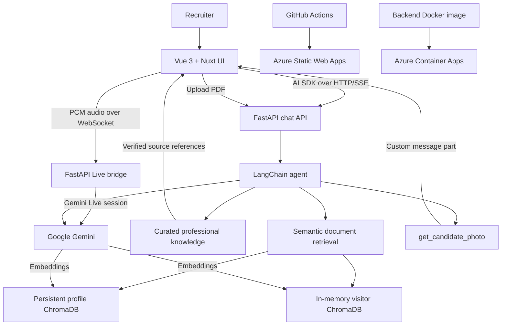

# awesome-ai-profile

> An interactive AI-powered professional profile built with Vue 3, Nuxt UI, FastAPI, LangChain and Gemini.

**Live application:** https://proud-mud-0ed95371e.7.azurestaticapps.net/

Instead of reading a static résumé, recruiters can talk to Django: an AI assistant representing Jeyker Salinas' professional profile. The project also serves as a practical portfolio for applied AI engineering, frontend development, backend integration and cloud deployment.

## What works today

- Responsive recruiter-facing chat built with **Nuxt UI**, **Vue 3**, **TypeScript** and **Tailwind CSS**.
- AI SDK for Vue (`@ai-sdk/vue`) with streamed responses, retry, cancellation and in-session conversation history.
- FastAPI backend that implements the written chat with the AI SDK UI Message Stream Protocol over **HTTP/SSE**; a Nuxt server is not required.
- Optional live voice mode powered by **Gemini 2.5 Flash Native Audio**, with microphone streaming, native spoken responses, interruption support and a lightweight animated call panel.
- A server-side FastAPI WebSocket bridge for live audio, keeping `GOOGLE_API_KEY`, professional context, tool execution and scoped RAG access in the backend.
- Gemini integration through LangChain, including real agent tool calling.
- A `get_candidate_photo` tool whose result appears inline as a custom photo card.
- Curated professional knowledge covering Jeyker's profile, employers, education, skills and projects.
- `get_profile_section` and `search_experience` tools with English/Spanish keyword retrieval.
- Answers grounded in verified knowledge files, with source references rendered directly in the chat.
- Semantic RAG with Gemini embeddings and separate persistent-profile and memory-only visitor stores.
- Temporary PDF upload and session-scoped retrieval across CVs, job offers, letters and other text-based documents.
- The selected interface language is sent to the agent, allowing Spanish or English answers from one English-language knowledge base.
- Extensible typed message parts for photos, technology badges and project cards.
- An approval component prepared for human-in-the-loop tools; an actual approval-required backend tool is still pending.
- English and Spanish localization with browser-language detection, an English fallback and a persistent language switcher.
- System-aware light/dark mode with a persistent toggle and Django's brand palette.
- An optional bilingual **Behind the chat** guided tour: seven animated chapters, UI spotlights and links to the actual implementation.
- An expandable **Agent activity** panel with observed model/tool executions, statuses, durations and retrieval result counts (not private chain of thought).
- Contextual EN/ES **Why is this feature so cool?** explanations on first use of eight features; local content with no extra LLM calls.
- Backend unit tests for request validation, conversation history, stream ordering and provider errors.
- Azure Static Web Apps deployment through GitHub Actions, plus Docker/Azure Container Apps deployment commands for the backend.

## Product goal

A recruiter should eventually be able to ask:

- Why should we hire Jeyker?
- What has he built with Vue, TypeScript and AI?
- What experience does he have with RAG, LLM applications and full-stack development?
- How was this project built and deployed?
- Can you show his profile photo, relevant projects or supporting sources?
- Can you send Jeyker a message after obtaining explicit approval?

The current assistant can stream answers, semantically search curated professional records and uploaded PDFs, cite its knowledge sources and execute the photo tool. Durable cloud storage and recruiter contact workflows remain planned.

## Current architecture

### Activity and contextual learning

Assistant messages expose real execution events in **Agent activity / Actividad del agente**. The first use of a feature introduces an optional explanation of its value, implementation and limitations. Repeated uses do not repeat the introduction; the original explanation remains available. No raw prompts, tool arguments or document excerpts are exposed by the activity feed, and opening explanations makes no API call. See [the activity implementation guide](docs/agent-activity.md) for the event contract, privacy boundaries, error handling and extension points.

### Explore the engineering story

Select **See how it’s built / Descubre cómo está hecho** on the welcome screen, or the route icon in the header at any time. The optional tour explains the interface, streaming, semantic retrieval, temporary documents, tool calling, localization and Azure delivery. It never starts automatically and does not send messages, upload files or call the model.

Each chapter highlights a relevant part of the interface, shows an explicitly illustrative animated flow, explains the engineering decision and links to its source code. Visitors can go back, jump between chapters, close with Escape or navigate with the arrow keys. The final chapter can prepare a question in the composer without sending it or overwriting a draft.

The implementation uses a lazy-loaded Vue component, native modal dialog semantics and CSS/SVG motion; no tour or animation dependency is required. English/Spanish and light/dark mode follow the existing preferences. Motion can be paused and respects `prefers-reduced-motion`. See [the implementation guide](docs/technology-tour.md) for architecture, extension points and the review checklist.



### Frontend

- Vue 3 and TypeScript.
- Vite and Vue Router.
- **Nuxt UI** and Tailwind CSS for the complete chat experience and design system.
- Vercel AI SDK for Vue: `useChat`, `DefaultChatTransport`, message parts and tool-approval responses.
- VueUse for persisted language preferences and automatic light/dark theme detection.
- Typed custom renderers for text, profile photos, technology lists, project cards and approval requests.
- English/Spanish localization with automatic detection and manual selection.

The project uses Nuxt UI as a Vue component library. It does **not** require Nuxt.js, Nitro or a hosted chat backend. Written chat uses HTTP/SSE; only the optional real-time voice session uses WebSockets.

### Backend and AI

- Python 3.12+, FastAPI and Pydantic.
- `POST /chat` for a regular JSON response.
- `POST /chat/stream` for the AI SDK UI Message Stream Protocol.
- `POST /documents` for text-based PDF upload, chunking and semantic indexing.
- `DELETE /documents/{document_id}` to immediately discard an uploaded document's in-memory chunks.
- `GET /health` for a basic health check.
- `WS /live/ws` for bidirectional 16 kHz microphone audio and 24 kHz Gemini audio responses.
- LangChain agent backed by Google Gemini.
- English-language JSON/Markdown knowledge files loaded by typed profile and experience tools.
- Bilingual keyword search for professional experience and projects.
- Gemini embeddings, LangChain recursive chunking and embedded ChromaDB semantic retrieval.
- Session-scoped access to heterogeneous uploaded documents, including job offers, CVs and letters.
- Locale-aware system prompts that translate verified facts into English or Spanish.
- Typed streaming events and custom candidate-photo message parts.
- Environment-based configuration for the model API key, CORS and deployment settings.
- Gemini Live tool declarations backed by the same `get_profile_section`, `search_experience`, `get_candidate_photo` and scoped `search_documents` implementations as written chat.

The current agent uses LangChain's `create_agent`. An explicitly modeled LangGraph workflow, provider switching, durable agent state and approval-gated side effects are future improvements rather than current capabilities.

## How document RAG works

The system does not require PDFs to share a common structure. A CV, an informal letter and a job posting are all converted into searchable text; metadata preserves their identity, purpose and source pages.

1. **Ingestion:** `POST /documents` validates a PDF and extracts selectable text from each page with `pypdf`.
2. **Chunking:** LangChain's `RecursiveCharacterTextSplitter` divides each page into overlapping pieces. Defaults are 900 characters per chunk with a 150-character overlap.
3. **Embeddings:** Google's `gemini-embedding-001` transforms every chunk into a vector representing its meaning.
4. **Storage:** Visitor document vectors, text chunks and metadata stay exclusively in an in-memory ChromaDB client; verified profile knowledge uses a separate persistent ChromaDB client.
5. **Profile seeding:** Existing JSON and Markdown knowledge files are indexed automatically the first time RAG is used. Stable content hashes prevent unchanged documents from being embedded again.
6. **Retrieval:** When the agent calls `search_documents`, the persistent profile and authorized temporary visitor documents are searched separately, then their most relevant results are combined.
7. **Generation:** Gemini receives those chunks through the LangChain tool and answers using the evidence. Retrieved filenames are streamed back to the UI as sources.

Every chat sends only its currently attached document IDs. Metadata filters limit the temporary collection to those specific documents, preventing another visitor's uploaded PDF from appearing in the conversation. Uploaded text is treated as untrusted evidence, not as instructions. Temporary documents are deleted immediately when removed from the chat and expire after 30 minutes of inactivity by default.

PDFs must contain selectable text. Image-only or scanned PDFs need OCR, which is not included in this version. Uploads are limited to 10 MB by default.

### Document upload example

```bash
curl -X POST http://127.0.0.1:8000/documents \
  -F 'file=@job-offer.pdf;type=application/pdf' \
  -F 'document_type=job_offer'
```

Supported document types are `cv`, `job_offer`, `letter` and `other`. The browser currently attaches files as `other`; semantic retrieval does not require a specific document classification.

### Storage, Docker and Azure

ChromaDB runs inside the existing backend process: it does not require PostgreSQL, pgvector, a second container or a separate cloud service. Only the verified professional-profile index is written to `VECTOR_STORE_PATH`, which defaults to `data/chroma`. Visitor PDFs are extracted into RAM, their vectors are stored through `chromadb.EphemeralClient()`, and neither their original PDF nor their indexed chunks are saved to the persistent volume.

For local persistence of the professional profile only, mount a Docker volume:

```bash
docker run --rm --env-file backend/.env \
  -e VECTOR_STORE_PATH=/app/data/chroma \
  -v awesome-ai-profile-chroma:/app/data/chroma \
  -p 8000:8000 app-backend
```

Without a persistent volume, the bundled professional-profile index is rebuilt automatically when the backend needs it. Visitor uploads are intentionally never durable: they disappear after `UPLOAD_TTL_MINUTES` of inactivity, when explicitly removed, or when the backend process restarts. Multiple backend replicas would require sticky sessions or a future shared temporary store with automatic expiration.

Embedding calls consume the configured Google API quota. Each unchanged bundled document is indexed once per persistent profile store, while each temporary PDF is indexed when uploaded; searches may embed the query once for the profile and once for the temporary collection. Retrieval reduces generation-token usage because the model receives only selected chunks instead of complete documents.

### Infrastructure and deployment

- **Frontend:** Azure Static Web Apps, deployed from `main` by GitHub Actions.
- **Backend:** Dockerfile and Makefile targets for Azure Container Registry and Azure Container Apps.
- **Local database groundwork:** Docker Compose can start PostgreSQL, but the application does not yet persist conversations or implement pgvector-based retrieval.

AWS remains an alternative for future experimentation, but Azure is the deployment platform represented by the current repository.

## Live voice mode

Select the microphone button beside the attachment control and grant browser microphone access. The browser converts microphone frames to mono 16-bit PCM at 16 kHz and sends them to FastAPI. FastAPI opens the Gemini Live session with the API key held server-side, relays native 24 kHz audio responses, executes tool calls and returns public status/transcription events to the interface.

The model defaults to `gemini-2.5-flash-native-audio-preview-12-2025`. The model and voice can be changed without code changes through `GEMINI_LIVE_MODEL` and `GEMINI_LIVE_VOICE`. Voice mode follows the selected English/Spanish locale, receives the recent written conversation as an initial context prefill and can search an attached temporary PDF when that document is present before the live session begins.

Browser microphone access requires HTTPS in production or localhost in development. The deployed backend must accept WebSocket upgrades, and its `CORS_ALLOW_ORIGINS` value must include the exact frontend origin. Audio-only Live API sessions are currently limited by the provider; reconnect to begin a new session after one ends.

## Versioning and releases

This project follows semantic versioning (`MAJOR.MINOR.PATCH`). The release prepared by this branch is **0.3.0**, adding the guided technology tour, observable agent activity and contextual feature explanations to 0.2.0.

- `develop` contains completed work that is being prepared for the next release.
- A pull request from `develop` to `main` promotes that version to production.
- Merging into `main` triggers the Azure Static Web Apps deployment workflow.
- After the production deployment succeeds, tag the corresponding `main` commit as `v0.3.0`.
- From 0.3.0, use `0.3.1` for backward-compatible fixes, `0.4.0` for the next compatible feature milestone, and `1.0.0` once the intended recruiter experience is stable.

The application version is recorded in `app/package.json` and `app/package-lock.json`. Git tags should point to the production commit, not to an unmerged development branch.

## Local development

Create the local environment files from the provided examples, configure `GOOGLE_API_KEY`, then use the Makefile targets:

```bash
cp backend/.env.example backend/.env
# Edit backend/.env and replace GOOGLE_API_KEY with your existing Google API key.
make install
make dev
```

`make install` installs both `google-genai==2.19.0` for the FastAPI Live connection and the existing frontend dependencies. No additional API key or browser-side secret is needed. The optional defaults in `backend/.env` are:

```dotenv
GEMINI_LIVE_MODEL=gemini-2.5-flash-native-audio-preview-12-2025
GEMINI_LIVE_VOICE=Kore
```

Useful commands:

```bash
make front              # Start the Vue/Vite frontend
make back               # Start the FastAPI backend
make type-check         # Check frontend TypeScript types
make build              # Build the frontend for production
make docker-back-build  # Build the backend Docker image
make docker-back-run    # Run the backend container locally
make acr-login          # Authenticate with Azure Container Registry
make deploy-back        # Build, push and deploy the backend to Azure
```

Run frontend tests (Markdown, activity, AI SDK data reconciliation and tour) with Node 22.18+ or 24.12+:

```bash
cd app
npm test
```

Run the existing backend tests with:

```bash
cd backend
python -m unittest discover -s tests -v
```

## Repository structure

```text
awesome-ai-profile/
├── app/                         # Vue 3 + Nuxt UI + AI SDK frontend
│   ├── public/django_design/    # Django logo, icons and brand assets
│   └── src/
│       ├── components/chat/     # Message, photo and approval components
│       ├── composables/         # Browser localization and preferences
│       ├── types/               # Typed message parts and stream contracts
│       └── views/               # Recruiter-facing chat
├── backend/                     # FastAPI + LangChain + Gemini
│   ├── agents/                  # Agent and callable tools
│   ├── knowledge/               # Curated profile, experience, education, skills and projects
│   ├── routes/                  # Chat API endpoints
│   ├── schemas/                 # Pydantic request/event models
│   ├── services/                # Agent and AI SDK SSE adapters
│   ├── tests/                   # Stream and request unit tests
│   └── Dockerfile
├── .github/workflows/           # Azure Static Web Apps deployment
├── docker-compose.yml           # Local PostgreSQL service
├── Makefile                     # Development and Azure deployment tasks
└── README.md
```

## Development roadmap

Checked items correspond to functionality present in the repository; unchecked items are still planned.

### Phase 0 — Project foundations

**Goal:** establish a working local development environment.

- [x] Create the frontend/backend monorepo structure.
- [x] Create the Vue 3 + TypeScript application.
- [x] Create the FastAPI application.
- [x] Add a `/health` endpoint.
- [x] Connect the frontend to the backend.
- [x] Run the frontend and backend together with `make dev`.
- [x] Add a production-ready backend Dockerfile.
- [x] Provide Docker Compose configuration for local PostgreSQL.
- [ ] Add consistent formatting and linting commands.
- [ ] Add a single command that also starts every required infrastructure service.

### Phase 1 — Recruiter chat and Nuxt UI

**Goal:** deliver a polished, useful conversational portfolio.

- [x] Build a responsive recruiter chat with Nuxt UI and Tailwind CSS.
- [x] Add predefined recruiter prompt suggestions.
- [x] Stream responses with the AI SDK protocol over HTTP/SSE.
- [x] Integrate Vue `useChat` with the existing FastAPI backend.
- [x] Connect the LangChain agent to Google Gemini.
- [x] Keep conversation history during the active chat session.
- [x] Add native real-time voice conversation through Gemini Live and a FastAPI WebSocket bridge.
- [x] Reuse professional context, agent tools and session-scoped RAG in voice mode.
- [x] Support cancellation, retry and structured streaming errors.
- [x] Render typed custom message parts and profile-photo cards.
- [x] Add English/Spanish localization with browser detection and manual switching.
- [x] Add system-aware light/dark mode with the Django brand palette.
- [ ] Add Markdown rendering and richer assistant-message formatting.
- [ ] Add a clean provider abstraction for swapping LLMs.
- [ ] Persist conversations across browser sessions.

### Phase 2 — Grounded professional knowledge and RAG

**Goal:** make answers factual, grounded and traceable.

- [x] Convert Jeyker's CV, projects, education and skills into curated documents.
- [x] Search verified professional experience using English or Spanish keywords.
- [x] Implement document ingestion and chunking.
- [x] Generate embeddings.
- [x] Add embedded ChromaDB semantic storage and PDF uploads.
- [ ] Configure PostgreSQL with pgvector.
- [x] Implement semantic retrieval.
- [x] Build grounded prompts around verified knowledge-tool results.
- [x] Cite supporting knowledge sources in the chat interface.
- [x] Add bilingual keyword-retrieval and knowledge-integrity tests.
- [ ] Add end-to-end grounded-answer evaluation tests.

### Phase 3 — Controlled agent tools

**Goal:** move from a conversational assistant to a safe, useful agent.

- [x] Create a LangChain agent with tool-calling support.
- [x] Implement the `get_candidate_photo` tool.
- [x] Render tool results inline as custom message components.
- [x] Prepare an approval UI for human-in-the-loop interactions.
- [ ] Introduce an explicit LangGraph workflow when orchestration complexity requires it.
- [ ] Model durable agent state explicitly.
- [x] Implement `search_experience`.
- [x] Implement `get_profile_section`.
- [ ] Implement `create_contact_request`.
- [ ] Require and enforce approval before side-effecting tools run.
- [ ] Add tool authorization, rate limits and audit logs.
- [ ] Test invalid, malicious and denied tool requests.

### Phase 4 — AI evaluation

**Goal:** measure answer quality instead of relying on impressions.

- [ ] Create a recruiter-question evaluation dataset.
- [ ] Measure retrieval relevance and expected-fact coverage.
- [ ] Evaluate groundedness and hallucinations.
- [ ] Measure request/model latency.
- [ ] Track token usage and estimated cost.
- [ ] Run regression evaluations in CI.
- [ ] Compare at least two model configurations.

### Phase 5 — Production engineering

**Goal:** improve reliability, safety and observability.

- [x] Add backend unit tests for chat requests and SSE message streams.
- [x] Add a basic backend health endpoint.
- [x] Configure CORS and environment-based secrets.
- [ ] Add API integration tests.
- [ ] Add frontend component tests.
- [ ] Add Playwright end-to-end tests.
- [ ] Add readiness checks and dependency health checks.
- [ ] Add rate limiting and request-size limits.
- [ ] Add structured logs, traces and metrics.
- [ ] Add retry, timeout and fallback policies.
- [ ] Add prompt/model versioning.
- [ ] Add security headers and dependency vulnerability checks.

### Phase 6 — Azure deployment

**Goal:** demonstrate ownership from source code to production.

- [x] Deploy the frontend to Azure Static Web Apps.
- [x] Build the backend with a production Dockerfile.
- [x] Provide Azure Container Registry login and image-push commands.
- [x] Provide Azure Container Apps backend deployment commands.
- [x] Configure HTTPS platform URLs and environment-based secrets.
- [ ] Provision and connect managed PostgreSQL.
- [ ] Configure centralized production logs and monitoring.
- [ ] Configure an optional custom domain.
- [ ] Document the actual Azure architecture and operating cost.

### Phase 7 — CI/CD

**Goal:** make quality checks and deployments reproducible.

- [x] Add a GitHub Actions workflow.
- [x] Build and deploy the frontend from `main` to Azure Static Web Apps.
- [x] Configure preview handling for pull requests targeting `main`.
- [ ] Run frontend linting and tests explicitly in CI.
- [ ] Run backend tests automatically.
- [ ] Run AI smoke evaluations.
- [ ] Build and publish the backend Docker image automatically.
- [ ] Deploy the backend automatically.
- [ ] Add rollback and release-recovery procedures.

### Phase 8 — Advanced AI engineering

Only after the grounded recruiter experience and controlled tools work end to end:

- [ ] Add model routing.
- [ ] Add semantic caching.
- [ ] Add reranking.
- [ ] Define a durable conversation-memory strategy.
- [ ] Add prompt caching where supported.
- [ ] Experiment with local/open-source models.
- [ ] Compare RAG configurations.
- [ ] Evaluate MCP integrations where they solve a concrete problem.
- [ ] Complete human-in-the-loop workflows for recruiter contact actions.
- [ ] Add automated prompt-injection and red-team cases.
- [ ] Evaluate multimodal CV and project inputs.

## Skills coverage

| Capability | Current evidence | Next evidence |
| --- | --- | --- |
| Vue / TypeScript | Nuxt UI recruiter chat, typed message parts and responsive UI | Component and end-to-end tests |
| AI application engineering | AI SDK streaming, Gemini, LangChain and source-grounded professional answers | Semantic retrieval and model evaluations |
| Tool calling | Profile search, verified knowledge sections and inline photo rendering | Recruiter contact and approval-gated tools |
| APIs | FastAPI JSON/SSE/WebSocket endpoints, Pydantic validation and health checks | API integration tests and rate limiting |
| Testing | Backend unit tests and frontend production type checks | CI test automation, E2E and AI evals |
| Docker / Azure | Backend Dockerfile, ACR/Container Apps commands and Static Web Apps | Automated backend delivery and monitoring |
| CI/CD | GitHub Actions frontend deployment from `main` | Full frontend/backend quality gates |
| RAG / vector search | Gemini embeddings, ChromaDB, PDF ingestion, scoped semantic retrieval and source citations | Durable cloud vector storage, retrieval evaluations and optional pgvector migration |
| Responsible AI | Server-side tool execution and an approval-ready interface | Enforced approvals, authorization and audit logs |

## Engineering principles

1. Working software over architectural theatre.
2. Current implementation and future plans must be clearly distinguished.
3. Simple architecture before distributed architecture.
4. Typed interfaces between frontend, backend and AI services.
5. Measurable AI behavior over impressive but unverifiable demos.
6. Incremental delivery, honest documentation and sensible operating costs.

The repository should never claim RAG, durable persistence, production monitoring or approval-gated actions until the corresponding capabilities actually exist.

## Definition of done

The project is complete when a recruiter can:

1. Open a public URL and use the Nuxt UI chat.
2. Ask a question about Jeyker in English or Spanish.
3. Receive a factual answer grounded in curated professional documents.
4. Inspect the sources supporting that answer.
5. Explore projects, technologies and other structured message components.
6. Send a contact request only after an explicit approval step.
7. Inspect automated tests, AI evaluations and a green CI pipeline.
8. Understand the Azure deployment architecture and operating costs.
9. Verify the implementation and engineering decisions in this repository.

At that point, the application and its commit history become part of the CV.
