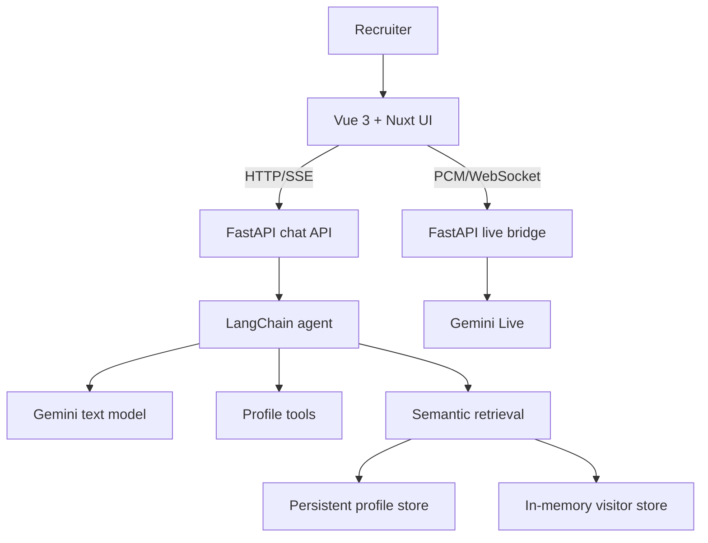

# awesome-ai-profile

> An interactive AI portfolio where recruiters can talk to Django, Jeyker Salinas' professional assistant, while seeing the engineering behind every feature.

[Versión en español](LEEME.md) · [Live demo](https://proud-mud-0ed95371e.7.azurestaticapps.net/)

This is not a résumé rendered as a chat. It is a working showcase of frontend engineering, agentic AI, RAG, real-time audio, observability and Azure deployment. A recruiter can ask about Jeyker's experience, inspect the sources behind an answer, upload a job offer for a temporary comparison, request his public contact details or speak directly with the assistant.

## Demo status

The current version is ready to present. The core experience works end to end in English and Spanish:

- Written chat with streamed responses, retry, cancellation and in-session history.
- Native live voice conversation with microphone streaming, spoken responses and interruption support.
- A FastAPI WebSocket bridge that keeps the Gemini API key and tool execution server-side.
- A LangChain agent backed by Gemini with observable tool calling.
- Curated professional knowledge plus semantic RAG over verified profile content.
- Temporary PDF ingestion for CVs, job offers, letters and other text documents.
- Inline citations, candidate photo cards and public contact details.
- An **Agent activity** panel showing model/tool events, duration and retrieval counts without exposing private chain of thought.
- Contextual **Why is this feature so cool?** explanations that teach the implementation without extra model calls.
- A bilingual guided tour of the technology behind the interface.
- Browser-language detection, manual EN/ES selection and persistent light/dark mode.
- Structured, secret-redacted logs and localized frontend error feedback with request references.
- A bilingual first-visit privacy notice for the public demo.

The experience is intentionally a demo: model quality, quota and live availability can be limited by the configured provider plan.

## What can a recruiter ask?

- Why should we hire Jeyker?
- What has he built with Vue, TypeScript and AI?
- What experience does he have with RAG, LLM applications and full-stack development?
- Compare Jeyker's profile with this job offer.
- Show me the evidence behind that answer.
- How was this project built and deployed?
- Show me Jeyker's photo.
- How can I contact Jeyker?

The assistant may offer Jeyker's authorized public contact details after detecting concrete professional interest. It does not send emails or messages and currently executes no side-effecting tools.

## Architecture



### Frontend

- Vue 3, TypeScript, Vite and Vue Router.
- Nuxt UI and Tailwind CSS as the component and design system.
- AI SDK for Vue (`@ai-sdk/vue`) and the UI Message Stream Protocol over HTTP/SSE.
- Typed renderers for text, sources, photos, activity events and tool approvals.
- Browser audio capture at 16 kHz PCM and playback of Gemini's 24 kHz audio.
- VueUse-backed preferences for language, theme, feature discovery, voice usage and the first-visit notice.

Nuxt UI is used as a Vue component library. This repository does not require Nuxt.js, Nitro or a Nuxt server.

### Backend and AI

- Python 3.12+, FastAPI and Pydantic.
- LangChain `create_agent` with Google Gemini.
- `gemini-3.1-flash-lite` for written agent responses.
- `gemini-3.1-flash-live-preview` for native live audio by default.
- `gemini-embedding-001` for semantic embeddings.
- ChromaDB with separate persistent-profile and in-memory visitor collections.
- Shared tools for profile sections, experience search, candidate photo, contact details and scoped document search.
- Structured JSON logs, request correlation and safe provider-error classification.

### Public endpoints

| Endpoint | Purpose |
| --- | --- |
| `GET /health` | Basic backend health check |
| `POST /chat` | Regular JSON chat response |
| `POST /chat/stream` | AI SDK UI Message Stream over SSE |
| `POST /documents` | Validate, extract, chunk and index a PDF |
| `DELETE /documents/{id}` | Remove a temporary visitor document |
| `WS /live/ws` | Bidirectional live audio and tool events |

## How RAG and document privacy work

Documents do not need a shared structure. A CV, job offer or letter is converted to selectable text, split into overlapping chunks and embedded for semantic search.

1. `pypdf` extracts text and page metadata.
2. LangChain's `RecursiveCharacterTextSplitter` creates 900-character chunks with 150-character overlap by default.
3. Gemini converts each chunk into an embedding.
4. Verified profile knowledge is stored in persistent ChromaDB.
5. Visitor documents are stored only in an in-memory `EphemeralClient`.
6. Every request authorizes only the document IDs attached to that conversation.
7. Retrieved filenames and verified knowledge paths are returned to the interface as sources.

Temporary uploads are deleted when removed, expire after 30 minutes of inactivity by default and disappear when the backend restarts. The original PDF is not written to the persistent vector volume. Uploaded content is treated as untrusted evidence, not as instructions.

PDFs must contain selectable text. Scanned/image-only PDFs require OCR, which is not implemented. The default upload limit is 10 MB.

## Live voice mode

The browser sends microphone audio to FastAPI, which opens a server-side Gemini Live session and relays native audio, transcripts, tool activity and public errors. The live session receives the selected locale, up to 20 recent written messages and any already-attached temporary document.

The browser keeps a lightweight daily turn count. The backend independently closes each WebSocket after `GEMINI_LIVE_MAX_TURNS` completed model turns (20 by default). This protects demo quota but is not a security boundary; strict enforcement would require authentication or a trusted server-side rate limiter.

Microphone access requires HTTPS in production or localhost during development. If a live session fails, run:

```bash
make live-diagnose
```

The diagnostic first tests a minimal Gemini Live connection, then repeats it with the agent tools enabled. It reads the configured key without printing it.

## Privacy and provider terms

On first visit, the interface explains that this is a limited public demo and asks the visitor not to submit personal, sensitive, confidential or third-party information. It also explains that messages, voice audio and attached documents are sent to Google Gemini and links to Google's current terms and privacy policy. Acknowledgement is stored only in that browser under a versioned `localStorage` key.

This notice improves transparency; it is not a privacy policy, a cookie banner, legal consent or a complete GDPR compliance mechanism. Before a public release, the operator must document the controller identity, lawful basis, processors, retention, international transfers and data-subject contact process as applicable.

Google's current Gemini API terms distinguish paid and unpaid services and make data-use rules depend on the plan and region. They also state that API clients made available to users in the EEA, Switzerland or the UK may use only Paid Services. A public deployment serving those regions should therefore use a Cloud project with active billing and be reviewed against the latest [Gemini API terms](https://ai.google.dev/gemini-api/terms) and [Google privacy policy](https://policies.google.com/privacy). Do not rely on the in-app notice to make an otherwise disallowed provider configuration compliant.

The application itself does not persist written chat history. Its structured logs record operational metadata and redacted error diagnostics, not API keys or raw provider responses. See [observability documentation](docs/observability.md).

## Local development

Requirements:

- Node.js 22.18+ or 24.12+.
- Python 3.12+.
- A Google Gemini API key.

```bash
cp backend/.env.example backend/.env
cp app/.env.example app/.env
# Replace GOOGLE_API_KEY in backend/.env.
make install
make dev
```

Useful commands:

```bash
make front              # Start the Vue/Vite frontend
make back               # Start the FastAPI backend
make type-check         # Check frontend TypeScript
make build              # Build the frontend for production
make live-diagnose      # Diagnose Gemini Live connectivity
make docker-back-build  # Build the backend image
make docker-back-run    # Run the backend container
make acr-login          # Authenticate with Azure Container Registry
make deploy-back        # Build, push and deploy the backend
make logs-back          # Follow structured application logs
make logs-back-system   # Read Container Apps system logs
```

Run the tests:

```bash
cd app && npm test
cd ../backend && python -m unittest discover -s tests -v
```

## Configuration

Important backend variables:

```dotenv
GOOGLE_API_KEY=replace-with-your-real-api-key
CORS_ALLOW_ORIGINS=http://localhost:5173,http://127.0.0.1:5173
VECTOR_STORE_PATH=data/chroma
UPLOAD_TTL_MINUTES=30
GEMINI_LIVE_MODEL=gemini-3.1-flash-live-preview
GEMINI_LIVE_VOICE=Kore
GEMINI_LIVE_MAX_TURNS=20
LOG_LEVEL=INFO
```

The frontend uses `VITE_API_BASE_URL` to locate FastAPI.

## Deployment

- **Frontend:** Azure Static Web Apps, deployed from `main` through GitHub Actions.
- **Backend:** Docker image in Azure Container Registry, running on Azure Container Apps.
- **Logs:** container standard output, available through Azure Container Apps and optionally Log Analytics.
- **Profile vectors:** an optional mounted volume at `VECTOR_STORE_PATH`.
- **Visitor vectors:** memory only; never stored in that volume.

`develop` contains the next release candidate. A pull request from `develop` to `main` promotes it to production, and merging into `main` triggers the frontend deployment workflow.

## Repository structure

```text
awesome-ai-profile/
├── app/
│   ├── public/django_design/    # Brand assets
│   ├── src/components/          # Chat, live mode, tour and privacy UI
│   ├── src/composables/         # Locale and persisted browser preferences
│   ├── src/features/            # Live, tour and feature-insight logic
│   ├── src/types/               # Typed message and event contracts
│   └── tests/                   # Frontend logic and contract tests
├── backend/
│   ├── agents/                  # Agent, tools and activity events
│   ├── knowledge/               # Verified professional knowledge
│   ├── routes/                  # HTTP and WebSocket endpoints
│   ├── schemas/                 # Pydantic contracts
│   ├── services/                # RAG, live audio, prompts and streaming
│   └── tests/                   # Backend unit tests
├── docs/                        # Tour, activity and observability guides
├── .github/workflows/           # Azure Static Web Apps CI/CD
├── docker-compose.yml
├── Makefile
├── LEEME.md
└── README.md
```

## What is intentionally not claimed yet

- No durable conversation memory.
- No authenticated per-user quota enforcement.
- No OCR for scanned PDFs.
- No production-grade authorization or rate limiting.
- No real human-in-the-loop side effect; the approval UI is prepared, but current tools are read-only.
- No raw chain of thought. The activity panel exposes operational events only.
- No complete GDPR compliance claim based solely on a first-visit disclaimer.

## Next milestones

- [ ] Add API integration and Playwright end-to-end tests.
- [ ] Run frontend and backend tests automatically in CI.
- [ ] Add authenticated rate limiting and abuse protection.
- [ ] Build a recruiter-question evaluation dataset.
- [ ] Measure groundedness, retrieval relevance, latency and token usage.
- [ ] Add readiness/dependency health checks and traces/metrics.
- [ ] Document the final privacy policy and production data-processing configuration.
- [ ] Automate backend image publishing, deployment and rollback.

## Engineering principles

1. Working software over architectural theatre.
2. Current capabilities and future plans must remain clearly separated.
3. Typed contracts across frontend, backend and AI services.
4. Verified evidence over impressive but ungrounded answers.
5. Observable behavior without exposing private reasoning or secrets.
6. Incremental delivery, honest documentation and controlled operating cost.
