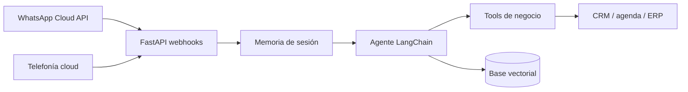

# Propuesta breve: RAG en WhatsApp y agente telefónico

## Objetivo

Convertir el agente existente en un asistente de negocio accesible desde WhatsApp y teléfono. Ambos canales comparten el mismo núcleo: modelo, herramientas, conocimiento verificado, RAG y memoria corta. La lógica del negocio no se duplica en cada proveedor.



## Prueba de concepto incluida

Esta rama implementa un corte vertical ejecutable, sin depender de credenciales durante las pruebas:

- Verificación y recepción de webhooks de WhatsApp Cloud API.
- Validación HMAC de cada evento de Meta.
- Extracción de mensajes de texto y respuesta mediante el agente/RAG existente.
- Envío de la respuesta por Graph API cuando se configuran las credenciales.
- Recepción de llamadas y turnos de voz mediante webhooks compatibles con Twilio.
- Validación de la firma de Twilio.
- Conversión Speech-to-Text de Twilio → agente/RAG → respuesta TwiML hablada.
- Memoria corta separada por número de WhatsApp o `CallSid`.
- Pruebas unitarias de firmas, contratos, memoria y endpoints, sin llamar a Meta, Twilio o Gemini.

La integración está desactivada si faltan secretos. Esta rama no registra números, textos ni audio en los logs.

## Flujo de WhatsApp

1. Meta entrega el mensaje al webhook y firma el cuerpo.
2. FastAPI valida la firma antes de procesar datos.
3. El endpoint confirma la recepción inmediatamente y procesa la respuesta en segundo plano.
4. El agente decide si consulta RAG o ejecuta una tool.
5. La respuesta vuelve al mismo usuario mediante WhatsApp Cloud API.

Para producción, el trabajo en segundo plano del proceso web debe sustituirse por una cola duradera. También se necesita idempotencia por `message_id` para absorber reintentos de Meta.

## Flujo telefónico inicial

La primera versión es conversacional por turnos:

1. Twilio atiende la llamada y transcribe una intervención.
2. FastAPI valida la firma del webhook.
3. El agente responde usando la misma memoria, tools y RAG.
4. Twilio sintetiza la respuesta y escucha el siguiente turno.

Este enfoque permite validar guiones, conocimiento, acciones y valor comercial antes de asumir la complejidad del audio en tiempo real.

La segunda fase conectaría Twilio Media Streams con Gemini Live, componente que el proyecto ya utiliza en navegador. Requiere un puente WebSocket adicional, transcodificación entre audio telefónico y PCM, interrupciones (`barge-in`), límites de sesión y métricas de latencia.

## Fases para un cliente real

| Fase | Entrega | Criterio de aceptación |
| --- | --- | --- |
| 1. Descubrimiento | Casos de uso, datos, handoff y límites | Flujos y acciones aprobados por el cliente |
| 2. WhatsApp | FAQ con RAG + 1 gestión real en CRM | Respuestas con fuente y operación trazable |
| 3. Teléfono | Llamada por turnos + transferencia humana | Tasa de resolución y fallback medidos |
| 4. Tiempo real | Audio full-duplex con interrupciones | Latencia y calidad dentro del SLA |
| 5. Operación | Cola, Redis, observabilidad y evaluación | Reintentos seguros, alertas y dashboard |

## Requisitos antes del despliegue

- Número y aplicación de Meta aprobados para WhatsApp Cloud API.
- Cuenta y número de telefonía cloud; la PoC usa contratos de Twilio.
- HTTPS público y `CHANNEL_PUBLIC_BASE_URL` estable para validar firmas.
- Tokens almacenados como secretos del entorno, nunca en frontend o repositorio.
- Redis y cola duradera para memoria, idempotencia y procesamiento asíncrono.
- CRM elegido y definición explícita de qué tools pueden producir efectos.
- Confirmación antes de acciones sensibles, transferencia a humano y política de retención.
- Evaluaciones con conversaciones reales anonimizadas: exactitud, groundedness, resolución, latencia y coste.

## Configuración de la PoC

```dotenv
CHANNEL_DEFAULT_LOCALE=es
CHANNEL_PUBLIC_BASE_URL=https://api.example.com
WHATSAPP_VERIFY_TOKEN=...
WHATSAPP_APP_SECRET=...
WHATSAPP_ACCESS_TOKEN=...
WHATSAPP_PHONE_NUMBER_ID=...
META_GRAPH_API_VERSION=v26.0
TWILIO_AUTH_TOKEN=...
```

Webhooks:

- Meta: `GET/POST /channels/whatsapp/webhook`
- Twilio Voice: `POST /channels/voice/incoming`

## Qué demuestra

La rama no pretende ser todavía un producto omnicanal terminado. Sí demuestra el núcleo técnico buscado en la oferta: APIs de LLM, RAG y tool calling compartidos entre canales; webhooks firmados; integración con WhatsApp y telefonía; backend desplegable en contenedor; y una ruta concreta hacia CRM, colas y operación en producción.
